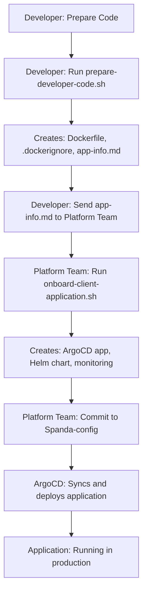

# 🎯 Proper GitOps Workflow - Separation of Concerns

## 🚨 **Problem Identified and Fixed**

**Previous Issue:** Mixed responsibilities in our automation scripts
- Developers were creating deployment configs in their repos ❌
- Platform security and consistency was compromised ❌
- GitOps model was diluted ❌

**Solution:** Clear separation of developer and platform responsibilities ✅

---

## 👨‍💻 **Developer Responsibility**

### **What Developers Do:**
1. **Prepare their application code**
2. **Ensure required endpoints exist** (`/health`, `/metrics`)
3. **Contact platform team for onboarding**

### **Developer Script: `prepare-developer-code.sh`**
**Location:** Provided to developers or hosted on platform website  
**Purpose:** Help developers prepare their code  
**Creates:**
- ✅ Production-ready Dockerfile
- ✅ Optimized .dockerignore
- ✅ `application-info.md` (info for platform team)
- ✅ Multi-service support (backend/frontend)

**Does NOT Create:**
- ❌ Kubernetes manifests
- ❌ Helm charts  
- ❌ ArgoCD applications
- ❌ Platform deployment configs

### **Developer Workflow:**
```bash
# 1. Developer runs preparation script in their repo
curl -s https://platform.spanda.io/prepare-code.sh | bash

# 2. Script validates app and creates necessary files
# 3. Developer sends application-info.md to platform team
# 4. Platform team handles the rest!
```

---

## 🏗️ **Platform Team Responsibility**

### **What Platform Team Does:**
1. **Receives onboarding requests from developers**
2. **Creates ALL deployment configuration in Spanda-config repo**
3. **Maintains security and consistency**
4. **Manages ArgoCD, monitoring, and infrastructure**

### **Platform Script: `onboard-client-application.sh`**
**Location:** Spanda-config repository only  
**Purpose:** Onboard new applications to platform  
**Creates:**
- ✅ ArgoCD application manifest
- ✅ Complete Helm chart with all resources
- ✅ Monitoring configuration
- ✅ Ingress and SSL setup
- ✅ Security policies
- ✅ Resource allocation based on requirements

### **Platform Team Workflow:**
```bash
# 1. Platform team runs onboarding script in Spanda-config repo
cd Spanda-config
./scripts/onboard-client-application.sh

# 2. Script creates all deployment configs
# 3. Platform team reviews and commits
git add .
git commit -m "Onboard new application: client-app"
git push

# 4. ArgoCD automatically syncs the new application
```

---

## 🔄 **Complete Workflow**



---

## 🎯 **Key Benefits of This Approach**

### **Security:**
- ✅ Developers never have access to platform deployment configs
- ✅ All security policies enforced by platform team
- ✅ Consistent resource allocation and limits

### **Consistency:**
- ✅ All applications follow same deployment patterns
- ✅ Standardized monitoring and logging
- ✅ Uniform ingress and SSL configuration

### **Simplicity:**
- ✅ Developers focus only on their application code
- ✅ Platform team has full control over infrastructure
- ✅ Clear separation of concerns

### **Maintainability:**
- ✅ Platform updates don't require developer changes
- ✅ Security patches applied consistently
- ✅ Infrastructure evolution handled centrally

---

## 📁 **Repository Structure**

### **Application Repository (Developer Managed):**
```
client-app/
├── src/                    # ← Application code
├── Dockerfile             # ← Generated by prepare script
├── .dockerignore          # ← Generated by prepare script
├── package.json           # ← Developer managed
├── README.md              # ← Developer managed
└── application-info.md    # ← For platform team
```

### **Spanda-config Repository (Platform Managed):**
```
Spanda-config/
├── apps/
│   └── client-app/        # ← Complete Helm chart
├── landing-zone/
│   └── applications/      # ← ArgoCD applications
├── cluster-config/
│   └── monitoring/        # ← Prometheus config
└── scripts/
    ├── prepare-developer-code.sh      # ← For developers
    └── onboard-client-application.sh  # ← For platform team
```

---

## 🚀 **Implementation Status**

### **✅ Completed:**
- Developer preparation script with clear boundaries
- Platform onboarding script with full deployment config creation
- Proper GitOps separation maintained
- Documentation updated

### **🔄 Next Steps:**
1. Remove/deprecate the mixed-responsibility `setup-application-repo.sh`
2. Test the new workflow with a sample application
3. Update developer documentation
4. Train platform team on new onboarding process

This approach maintains the **pure GitOps model** while providing **excellent developer experience**! 🎉
